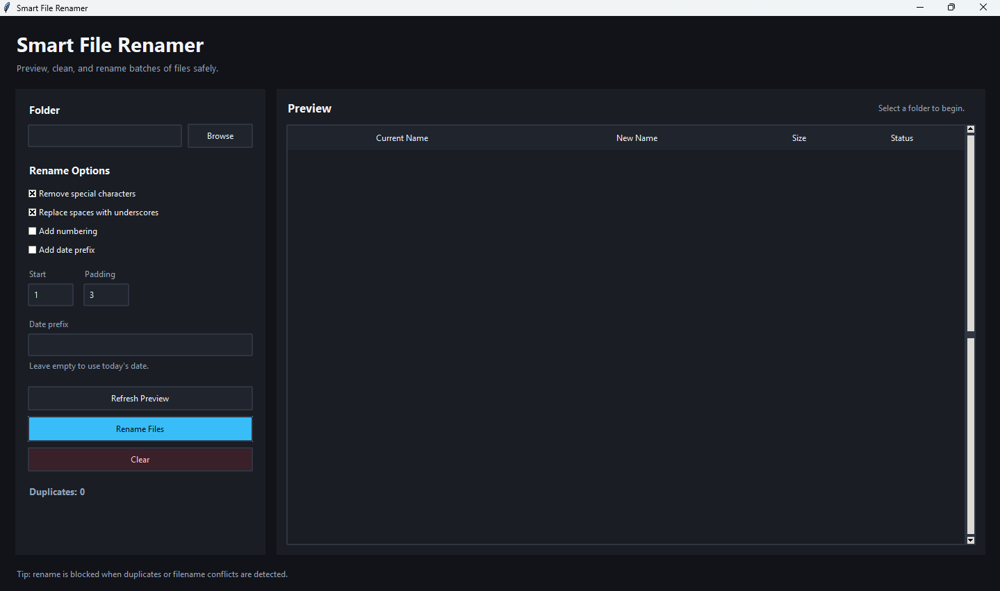
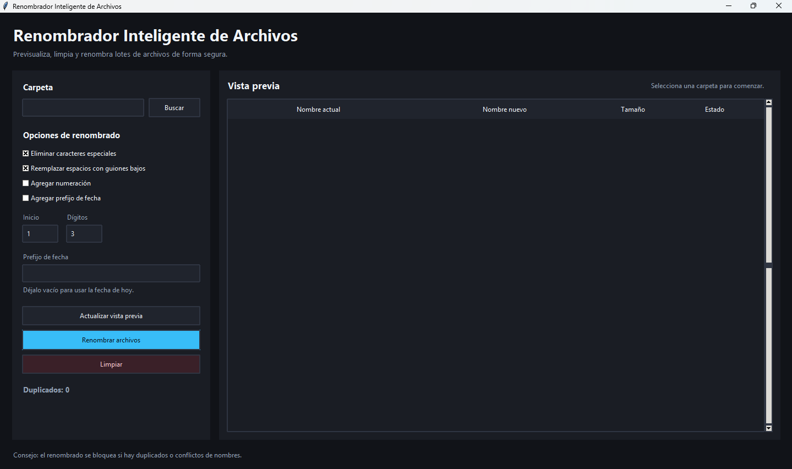

# Smart File Renamer / Renombrador Inteligente de Archivos


## Preview / Vista previa

### English Version



### Versión en Español



## English overview

Smart File Renamer is a clean Windows desktop app for previewing and bulk-renaming files safely. It provides an English interface, a Spanish interface, duplicate detection, and an EXE-ready project structure powered by Python, Tkinter, and PyInstaller.

Both app versions live in the same repository and share the same backend logic.

- English launcher: `main.py`
- Spanish launcher: `main_es.py`
- Shared rename logic: `renamer.py`
- Shared utilities: `utils.py`

## Descripción en español

Renombrador Inteligente de Archivos es una aplicación de escritorio para Windows que permite previsualizar y renombrar archivos por lotes de forma segura. Incluye interfaz en inglés, interfaz en español, detección de duplicados y una estructura lista para compilar ejecutables con Python, Tkinter y PyInstaller.

Ambas versiones de la app viven en el mismo repositorio y comparten la misma lógica interna.

- Lanzador en inglés: `main.py`
- Lanzador en español: `main_es.py`
- Lógica compartida de renombrado: `renamer.py`
- Utilidades compartidas: `utils.py`

## Features / Características

- Select a folder / Seleccionar una carpeta
- Preview current and future filenames / Previsualizar nombres actuales y nuevos
- Bulk rename files / Renombrar archivos por lotes
- Remove special characters / Eliminar caracteres especiales
- Replace spaces with underscores / Reemplazar espacios con guiones bajos
- Add automatic numbering / Agregar numeración automática
- Add a date prefix / Agregar prefijo de fecha
- Detect duplicate target filenames / Detectar nombres duplicados
- Block unsafe rename operations / Bloquear renombrados inseguros
- Dark modern desktop UI / Interfaz moderna en modo oscuro
- English and Spanish launchers / Lanzadores en inglés y español

## Download / Descargar

Download the latest portable Windows release here:

[Latest release](https://github.com/federicoramos67/smart-file-renamer/releases/latest)

Descarga la última versión portable para Windows aquí:

[Última versión](https://github.com/federicoramos67/smart-file-renamer/releases/latest)

## How to run / Cómo ejecutar

Use Python 3.10 or newer on Windows.

Usa Python 3.10 o superior en Windows.

```powershell
python -m venv .venv
.\.venv\Scripts\activate
pip install -r requirements.txt
```

Run the English version:

```powershell
python main.py
```

Ejecutar la versión en español:

```powershell
python main_es.py
```

## Build executable / Compilar ejecutable

The included PowerShell script builds both portable Windows executables with PyInstaller.

El script de PowerShell incluido compila ambos ejecutables portables para Windows con PyInstaller.

```powershell
pip install -r requirements.txt
.\build_exe.ps1
```

Generated files / Archivos generados:

```text
dist/SmartFileRenamer_EN.exe
dist/RenombradorInteligente_ES.exe
```

Manual PyInstaller commands / Comandos manuales de PyInstaller:

```powershell
python -m PyInstaller --noconfirm --clean --windowed --onefile --name SmartFileRenamer_EN main.py
python -m PyInstaller --noconfirm --clean --windowed --onefile --name RenombradorInteligente_ES main_es.py
```

## Project structure / Estructura del proyecto

```text
Smart File Renamer/
|-- main.py                 English desktop app
|-- main_es.py              Spanish desktop app
|-- renamer.py              Shared rename engine
|-- utils.py                Shared helpers
|-- build_exe.ps1           Windows EXE build script
|-- requirements.txt        Python dependencies
|-- .gitignore              Python and build ignores
`-- README.md               Bilingual documentation
```

## Rename safety / Seguridad del renombrado

The app always creates a preview before renaming. Renaming is blocked when two or more files would receive the same name, or when a target filename already exists in the selected folder.

La app siempre genera una vista previa antes de renombrar. El renombrado se bloquea si dos o más archivos recibirían el mismo nombre, o si el nombre de destino ya existe en la carpeta seleccionada.
